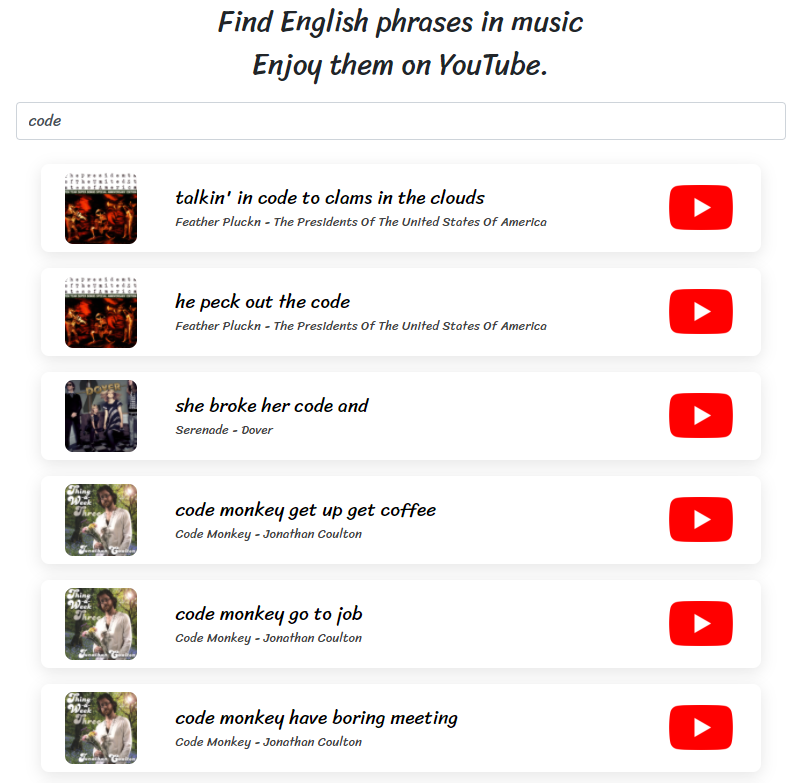
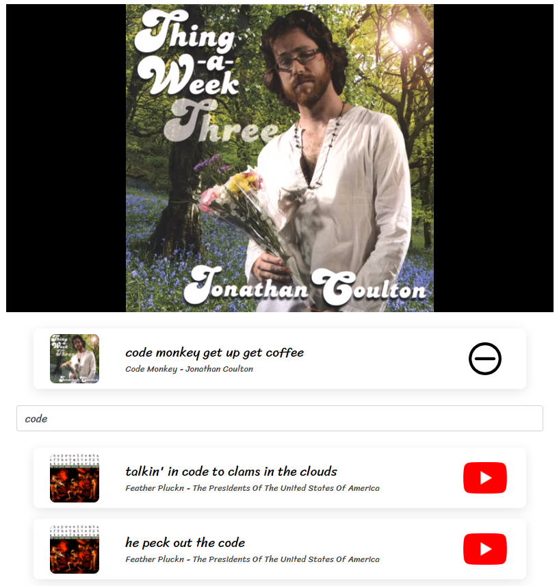

# eng2music

[LINK](https://ialy1595.me/eng2music/)

## Introduction

When you learn English words or phrases, you may want to know how they are pronounced. eng2music can be helpful in this case.

Searching for an English word or phrase shows the phrase that contains the word in the music. Click the YouTube button to repeat the phrase on YouTube.

## Dataset

Dataset from [DALI](https://github.com/gabolsgabs/DALI), a large Dataset of synchronised Audio, LyrIcs and vocal notes. ([License](https://creativecommons.org/licenses/by-nc-sa/4.0/))

The synchronised lyrics and corresponding YouTube links are provided. Because not all links to songs are valid, they were processed and used only the possible ones. As a result, 1071 songs with 33916 phrases are used in this project.

## License

[MIT](https://github.com/ialy1595/eng2music/blob/master/LICENSE)